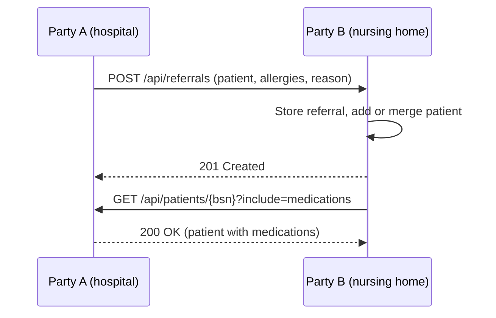

# Design

This document describes how the API works and specifies the reason for various behavior. For running and testing the project, see the [README](../README.md).

## The case

A patient is discharged from Ziekenhuis A (a hospital) and referred to Verpleeghuis B (a nursing home). A sends a referral letter with the patient's allergies to B. When the patient arrives, B asks A for the patient's medication.

Authentication, authorisation and a user interface are out of scope.

A database system is optional.

| Requirement                     | Where                                                                                           |
| ------------------------------- | ----------------------------------------------------------------------------------------------- |
| Exchange documents via REST     | [How it works](#how-it-works), [documents as JSON](#documents-as-structured-json)               |
| Validation                      | [Validation and error handling](#validation-and-error-handling), [BSN](#patients-are-identified-by-bsn) |
| Error handling                  | [Validation and error handling](#validation-and-error-handling)                                 |
| Log what was exchanged, by whom | [Logging](#logging), [X-Identity](#x-identity-instead-of-authentication)                        |
| Readable, maintainable code     | [Contracts separate from models](#contracts-separate-from-models), [testing](#testing)          |
| Database (optional)             | [In-memory storage](#in-memory-storage)                                                         |

## How it works

Every care provider runs its own instance of the API, called a party. Locally these are Party A and Party B, started from the same code. Party A starts with a test patient, as if it's the hospital's own records.



- **Receiving a referral:** the referral is validated and stored as it was received, with who sent it. The patient is added or merged depending on the BSN, which is the key of the patient.
- **Sharing patient information:** the patient is looked up by BSN and returned with only its core data provided unless the request provides `include` and the relevant data it wants included. An unknown patient returns `404`.

The identity of the request is provided with the `X-Identity` header, and both exchanges are logged with the identity, so it's traceable who exchanged what.

## Design choices

### A separate instance per care provider

Each care provider keeps its own data and decides what it shares, like they do in reality. A central system holding everyone's data would be simpler, but doesn't match that.

Each party also has its own in-memory database, so the data of the parties is kept apart.

The API only receives and shares, it doesn't call other parties itself. Sending a referral is something the care provider's own system does, and building that into the API would mix two responsibilities. This belongs in a separate service, or a background service if the API should do it. For now the [http file](../src/DocumentExchange.Api/DocumentExchange.Api.http) does the calling as it shows the behavior exactly as it's intended.

### Documents as structured JSON

A document is a JSON body, not an uploaded file. With JSON every field can be validated, and the logs can say what kind of information was exchanged. A PDF is just a blob.

### Patients are identified by BSN

The BSN is what care providers in the Netherlands use to identify a patient, so both parties already know it. Two patients are equal when their BSN is equal, which is what the merge system relies on as an example.

A BSN has to be exactly 9 ASCII digits and pass the 11-check as intended with the format. Other Unicode digits, such as full-width `９`, are refused on purpose. Supporting them is possible, but normalising them risks possibly accepting data that was not intended to work, and therefore the API is designed with strictness in mind. If support is ever needed, it could be added with the `Rune` type.

### Merging patients instead of replacing them

A referral only contains allergies. Replacing the patient would lose the medications that were already known, so the referral is merged instead:

- The name is taken from the newest data, the date of birth only when one is sent.
- Allergies and medications are combined, matched on substance and name. The newest version wins.

An allergy can't be removed through a referral, but missing an allergy is worse than having one too many.

The referral itself keeps the patient exactly as it was sent. That way you can always see what a party sent, even after the patient has been merged.

### Only share what is asked for

Allergies and medications are only returned when asked for with `include`, so a party only gets the medical information it needs. This inclusion is scalable with new values should they be added.

Unknown values return `400` instead of being ignored, making typos like `?include=alergies` return an error that makes clear what is accepted.

### X-Identity instead of authentication

The `X-Identity` header is stored as the owner of a referral and written to the logs, so it's clear who exchanged what. It isn't authentication, anyone can put any name in it. That's why a missing header returns `400` and not `401`. A `401` would suggest something was verified, but this API has no authentication.

The header works like a token would: every request says who it's from, and it's checked in one place. Moving to JWT later only changes where the identity comes from, not the endpoints or the logging.

As per the case, authentication was not added as it's out of scope. Therefore this is merely a solution to fit the case, but a basis is provided to extend to a JWT when authentication is preferred.

### Contracts separate from models

Requests and responses have their own types, separate from the models that are stored. What the API stores and what parties send or receive can change independently, and nothing is shared by accident. The contracts also hold the validation, so each endpoint has its own rules for what it accepts.

### Validation and error handling

Requests are validated with data annotations and the built-in validation of .NET 10. BSN and date of birth have their own attributes, and strings have a maximum length so a party can't send endlessly large data.

All errors are returned as [problem details](https://www.rfc-editor.org/rfc/rfc9457): `400` with the invalid fields, `404` for an unknown patient, and `500` without internal details for anything unexpected. Malformed JSON also returns `400` instead of an exception as it provides better clarity and also falls under being an invalid parameter.

### In-memory storage

Data is stored in memory instead of a database like Postgres, so the project runs without any setup. The endpoints only use repository interfaces, so a real database can replace the in-memory implementation without changing them.

In development, a test patient is added on startup when `SeedDatabase` is on. Fake data can't end up in a real environment this way.

### Logging

The case asks to log that information was exchanged between parties, and what was shared between these parties. Logging is provided by Serilog, and every request is logged with who made it and the result. The endpoints additionally log what was received or shared:

```text
Shared patient 999990019 with Verpleeghuis B including [Medications]: 0 allergies, 3 medications
```

The logs say who requested the information, which patient was requested and what kind of information was requested, but never details the medical content. Health data is sensitive under the GDPR (AVG), and logs are usually less protected than the data itself. NEN 7513, the Dutch standard for logging in healthcare, asks for the same.

Each party writes its own log file as JSON, so it can be filtered on values like `Identity` or `Bsn`. The logs do contain BSNs, because the API has no other id for a patient yet. In production the BSN should be replaced by a unique public id, so the logs don't reveal who the patient is.

Logs aren't a reliable record of what was exchanged, since lines can get lost and are removed after 7 days. For that, each exchange should be stored as its own record. To search the logs across parties, they could be sent to a central log system, such as Seq or Grafana Loki.

## Testing

Unit tests cover the logic, such as BSN validation and merging patients. Integration tests run the API in memory and call the endpoints over HTTP.

There's no test that plays the whole case between two parties. The endpoints are already tested and the http file shows the flow. Such a test would only cover one specific order of calls and it's better off being a one-off manual test using the [http file](../src/DocumentExchange.Api/DocumentExchange.Api.http).
